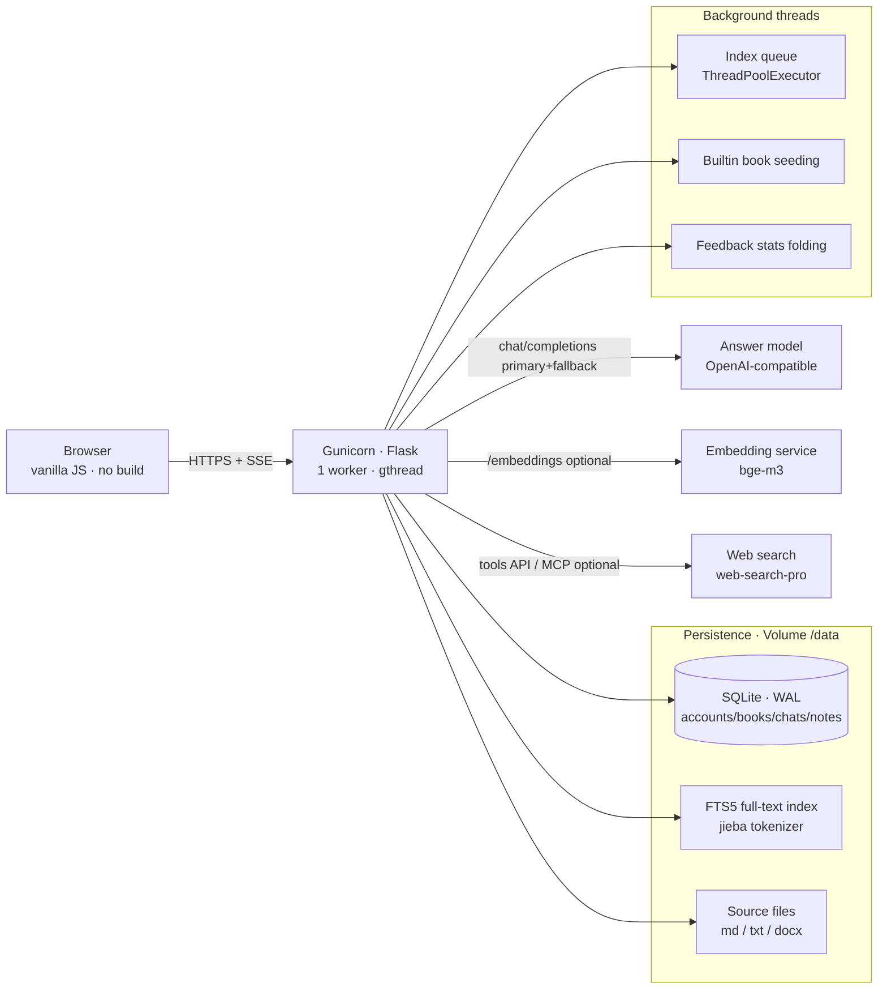
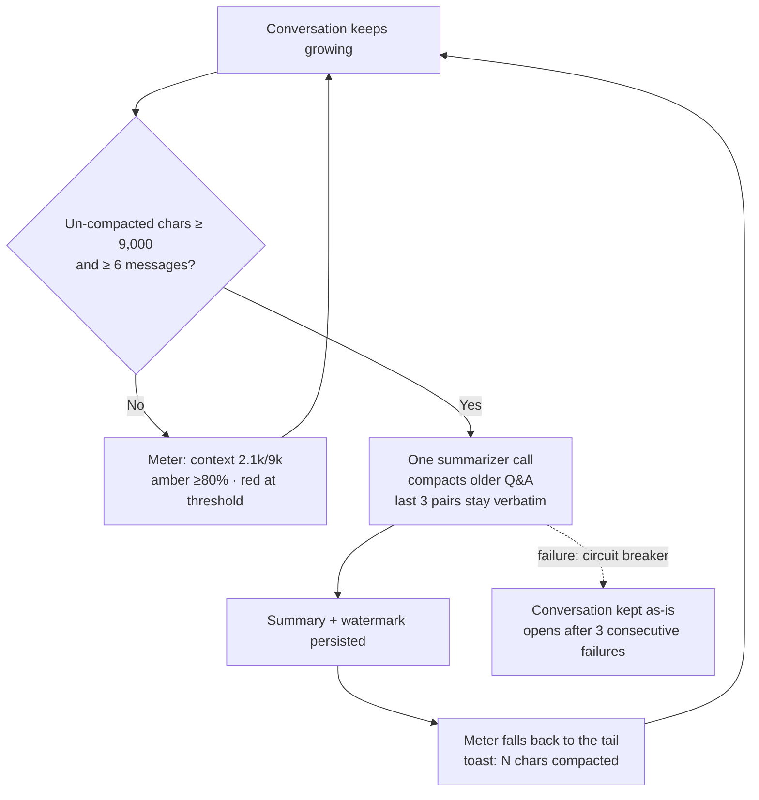
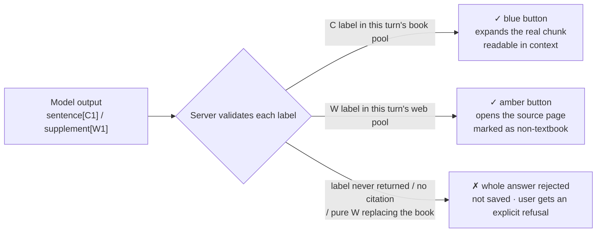

# 书内 · Book Learning

**English** · [中文](README.zh-CN.md)


**Put your textbooks on the shelf — and let every answer lead you back to the original text.**

Book Learning (「书内」, a.k.a. BOOKNOTE) is a self-hostable, multi-account textbook study workspace: upload Markdown / TXT / DOCX textbooks, switch between Q&A, chapter explanation, key-point outlining and self-testing, and get answers whose every claim carries an expandable citation back to the source text. It ships with an annotation reader, automatic long-conversation compaction, and an opt-in web-search supplement. All data is scoped by account and by book — one book per retrieval context, no cross-book leakage.

---

## Diagrams

### Diagram 1 · System architecture

A single-instance Flask service (one Gunicorn worker); SQLite holds all state. The only external dependencies are model / embedding / search services — each optional, each degradable:



**Notes**: The browser talks only to this service (strict CSP, no third-party requests). Retrieval runs three channels — lexical, FTS5, vector — fused with equal-weight RRF (k=60); without an embedding service it explicitly degrades to keyword retrieval and says so in the UI. Web search is a separate toggle; when off, the system stays strictly book-scoped.

### Diagram 2 · Data flow of one question

Q&A mode lets the model drive retrieval itself; classic single-shot retrieval is the fallback:

```mermaid
sequenceDiagram
    participant U as User
    participant S as Server
    participant M as Model
    participant W as Search MCP (optional)
    U->>S: Ask (POST /messages, SSE)
    S-->>U: status · searching this book
    loop autonomous search ≤ 10 calls
        M->>S: search_book(keywords)
        S-->>M: book chunks + C citation labels
        S-->>U: search · N passages hit
    end
    opt user enabled "web supplement"
        M->>W: web_search(terms) ≤ 4 calls
        W-->>M: page results + W labels
        S-->>U: search · N sources hit
    end
    M-->>S: strict-JSON answer (inline [C1][W1] markers)
    S->>S: citation whitelist validation
    alt validation passes
        S-->>U: delta live preview → answer → context (meter update)
    else missing / fabricated citations
        S-->>S: whole answer rejected, not persisted
    end
```



**Notes**: Citation labels are assigned by the server at retrieval time; the model may only use labels it was given. Answers with missing citations, fabricated labels, or web content standing in for textbook evidence are rejected wholesale and never saved. The UI streams every search step live and keeps the full trace under the answer.

### Diagram 3 · Conversation compaction & the context meter

The meter right of the composer shows un-compacted context against the compaction threshold; compaction itself runs server-side, automatically:



**Notes**: The summary rides along as untrusted context on later prompts (the system prompt forbids treating it as instructions), and citation markers never enter it. An SSE `context` event refreshes the meter after every answer; reopening a conversation restores the reading from the history endpoint.

### Diagram 4 · The citation trust chain

C labels (textbook) and W labels (web) are validated on separate tracks — this is how "no evidence, no answer" is actually enforced:



**Notes**: A textbook citation expands the cited chunk plus its neighbours (keep reading, add annotations in the reader); a web citation is supplementary only, and every answer must anchor on at least one C citation overall.

---

## Features

- **Multi-account workspace** — registration / login / one-code-one-account test codes / bring-your-own API key; PBKDF2 passwords, session cookies + CSRF. Books, conversations, annotations and source files are scoped by account *and* book.
- **Upload & indexing** — UTF-8 `.md` / `.markdown` / `.txt` / `.docx`; heading detection; background chunk indexing (≤ 1200 chars per chunk, 160 overlap by default); 20 MB / 4 M chars per file; 20 books / 50 MB per account.
- **Four study modes** — Q&A (model-driven multi-round retrieval), chapter explanation, key-point outlining, self-testing (answers folded by default); retrieval can be narrowed to a section.
- **Evidence-constrained generation** — as in Diagram 4: answers must stand on this turn's retrieved evidence; otherwise an explicit refusal.
- **Annotation reader** — full-text reading, citation-anchored context, three-colour highlights and private notes (never sent to the model).
- **Compaction + context meter** — as in Diagram 3.
- **Opt-in web supplement** — appears only when `STUDY_SEARCH_API_KEY` is set (defaults to Zhipu's `web-search-pro` tools API — any ordinary Zhipu key works; a remote MCP is also supported), off by default; as in Diagram 2, only model-distilled search terms ever leave the server.
- **Logs & feedback stats** — per-call traces (3-day retention); ratings fold into fixed-period statistics.

## Quick start (local)

Python 3.11+; the frontend is vanilla JS/CSS with no build step:

```sh
python -m venv .venv
# activate the venv for your shell
python -m pip install -r requirements.txt
copy .env.example .env   # fill in model settings (Windows)
python -m study
```

Open `http://127.0.0.1:8080`. Regression tests: `python -m unittest discover -s tests -v` (fully offline, no live model calls).

## Environment variables

| Variable | Purpose |
|---|---|
| `STUDY_SECRET_KEY` | **Required**; persistent random secret, 32+ chars; rotating it invalidates all sessions |
| `STUDY_DATA_DIR` | Data directory; on Railway mount a Volume at `/data`, locally defaults to `.study-data/` |
| `STUDY_COOKIE_SECURE` | Must be `1` behind HTTPS; `0` only for local HTTP |
| `STUDY_LLM_BASE_URL` / `STUDY_LLM_API_KEY` / `STUDY_LLM_MODEL` | Answer model, OpenAI-compatible `/chat/completions` |
| `STUDY_LLM_MAX_TOKENS` | Output budget (1000–200000); raise for reasoning models |
| `STUDY_LLM_JSON_MODE` | Set `1` only if the model supports `response_format=json_object` |
| `STUDY_LLM_FALLBACK_*` | Optional fallback model; switching happens only before the first visible delta |
| `STUDY_EMBED_BASE_URL` / `STUDY_EMBED_API_KEY` / `STUDY_EMBED_MODEL` | Optional embeddings (OpenAI-compatible `/embeddings`); reindex after changing the model |
| `STUDY_SEARCH_API_KEY` | Optional web search: defaults to Zhipu's tools API (`web-search-pro`, any ordinary Zhipu API key works); set `STUDY_SEARCH_MCP_URL` to use a remote MCP instead (plan-specific key), `STUDY_SEARCH_BASE_URL` overrides the endpoint; unset = strictly book-scoped |
| `STUDY_REGISTRATION_OPEN` / `STUDY_TEST_CODES` / `STUDY_INVITE_CODE` | Registration policy: open signup / one-code-one-account / invite code |
| `STUDY_MAX_USERS` / `STUDY_MAX_BOOKS` | Defaults: 100 accounts / 20 books per account |

Secrets live only in environment variables (Railway Variables / local `.env`), never in git; `.env`, source books and local data directories are excluded from both Git and the Docker context.

## Deploying to Railway

1. Connect the repository to a dedicated Railway service using the in-repo `Dockerfile` (health check `/health`).
2. Attach a persistent Volume at `/data`; set `STUDY_DATA_DIR=/data` and `STUDY_COOKIE_SECURE=1`.
3. Keep **1 replica, 1 Gunicorn worker** (SQLite + a single-instance index queue; externalize the database and job queue before scaling out).
4. `railway up` also works from a local checkout; `builtin_books/` live only on the local disk — never in git — and are baked into the image at build time.
5. `railway up` packs its upload context following git's visibility rules, so the builtin books must stay out of git **and** inside the build context: they are plain untracked files, protected from accidental commits by a local pre-commit hook. After a fresh clone, restore the guard:

   ```sh
   printf '#!/bin/sh\nif git diff --cached --name-only | grep -q builtin_books/; then\n  echo "ERROR: builtin_books/ must never be committed." >&2\n  exit 1\nfi\n' > .git/hooks/pre-commit
   chmod +x .git/hooks/pre-commit
   ```

## Privacy & boundaries

- Data is isolated per account but **not end-to-end encrypted**; the deployment admin can access the Volume.
- With embeddings configured, indexed chunks go to that service at index time; at question time, hit passages and recent questions go to the answer model; with the web toggle on, only distilled search terms (never the full conversation) go to the search MCP.
- Web content is unverified and does not represent the textbook; legal textbooks may be outdated — answers are not current-law statements or personal legal advice.
- No email verification, password recovery, admin panel, billing, or stream-rollback on cancel; cancelling only drops the browser request, the backend may still finish.

## Project layout

```text
study/            # Flask backend
  app.py          #   routes, SSE answer stream, accounts & quotas
  tutor.py        #   evidence-constrained generation, agent loop, C/W validation
  rag.py          #   lexical / FTS5 / vector retrieval fused with RRF
  reader.py       #   full-text reader and annotation API
  websearch.py    #   search-MCP client (streamable HTTP)
  compaction.py   #   rolling conversation compaction + context meter
  documents.py    #   md / txt / docx parsing and chunking
  database.py     #   SQLite schema and migrations
web/              # vanilla JS / CSS frontend (no build)
tests/            # 114 offline regression tests
docs/             # topical docs (architecture / configuration / development / maintenance)
builtin_books/    # builtin textbooks (local only, never in git)
```

## License

[GPL-3.0](LICENSE)
