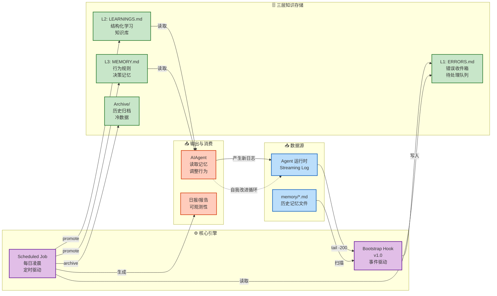

# Booknote · Book-scoped RAG Course Tutor

The primary application is now a Railway-ready, multi-account textbook learning workspace. Upload UTF-8 Markdown/TXT books, switch the active book, and use Q&A, chapter explanations, outlines, or self-tests with inspectable chapter/chunk citations. Scanned PDFs must be OCR'd to Markdown first; images are not indexed.

Retrieval and stored conversations are filtered by both account and book before generation. The backend combines lexical matching, jieba-tokenized SQLite FTS5 and optional OpenAI-compatible embeddings with RRF. Without an embedding service it explicitly reports keyword-only retrieval. Invalid citation identifiers are rejected; this is not a guarantee that every model claim is entailed by its cited passage.

See [the complete setup and limitations](README.zh-CN.md) and [.env.example](.env.example). Local startup: install `requirements.txt`, configure the model, then run `python -m study` at `http://127.0.0.1:8080`. The vanilla web UI requires no frontend build. The original TypeScript build remains for the preserved OpenClaw hook only.

On Railway, use `Dockerfile` / `railway.toml`, attach a Volume at `/data`, set `STUDY_DATA_DIR=/data`, a persistent random `STUDY_SECRET_KEY` (32+ characters), `STUDY_COOKIE_SECURE=1`, and `STUDY_LLM_BASE_URL/API_KEY/MODEL`. Set `STUDY_INVITE_CODE` for classroom registration. Keep one replica and one Gunicorn worker; background indexing and SQLite are single-instance. Source books, credentials, and `Asset/` are excluded from Git and the Docker context.

Book excerpts are sent to the configured LLM; configuring embeddings also sends indexed chunks to that service. Reindexing clears the book's conversations to invalidate old references. This version has no email verification, password recovery, learning-plan scheduler, or billing system.

Regression tests are provided for manual execution: `python -m unittest discover -s tests -v`. Implementation was statically reviewed only; no builds, tests, live model calls, or actual Railway deployment were performed.

---

## Preserved OpenClaw auto-learning hook

The following legacy documentation describes a separate hook, not the course tutor.

[](#)
[](#)
[](#)
[](#)
[](./LICENSE)
[](#)

> **中文**：面向 AI Agent 的自动学习系统：启动检测错误、定时提升经验、持续沉淀行为记忆。\
> **English**: A self-improvement system for AI agents: detect errors at bootstrap, promote learnings on schedule, and accumulate durable behavioral memory.
> - auto-detect error signals at bootstrap
> - write structured inbox entries to `ERRORS.md`
> - promote learnings into `LEARNINGS.md` / `MEMORY.md`
> - enforce idempotency, dedup, cooldown, archive, and safe writes

---

[中文文档 (README.zh-CN.md)](./README.zh-CN.md)

---

## Why this exists

Agents often repeat the same mistakes across sessions.\
This project turns runtime failures and user corrections into durable operational knowledge.

**Goal:** make the system continuously improve from “error → extraction → learning → memory”.

---

## Workflow Overview (Self-Improvement Loop)



---

## Key Features

- **Bootstrap Hook v1.0 (core)**
  - scans recent memory files
  - scans only latest log file’s **last 200 lines**
  - captures **±20 lines** context around hits
- **Robust write safety**
  - lock file (concurrency protection)
  - atomic write (`tmp -> rename`)
- **Noise control**
  - in-run dedup by canonical key
  - cross-run cooldown dedup (24h)
- **Priority-based promotion**
  - `low`: resolve only
  - `medium`: write `LEARNINGS.md`
  - `high/critical`: write `LEARNINGS.md` + `MEMORY.md`
- **Idempotency contract**
  - dedup by `Source-Err-ID` during promotion
- **Knowledge-base hygiene**
  - archive oversized `LEARNINGS.md`
  - end-of-day `ERRORS.md` reset (after success only)

---

## Architecture

```text
[Bootstrap Hook v1.0]
  ├─ scan memory/*.md (recent files)
  ├─ scan latest streaming log (last 200 lines)
  ├─ detect patterns + capture context window (±20)
  ├─ canonical dedup + 24h cooldown
  ├─ lock + atomic write -> .learnings/ERRORS.md
  └─ inject SELF_IMPROVEMENT_REMINDER.md (virtual bootstrap file)

[Scheduled Auto-Learning Job]
  ├─ parse pending ERR blocks
  ├─ route by priority (low/medium/high/critical)
  ├─ idempotent write to LEARNINGS / MEMORY
  ├─ mark resolved + Processed-At + Disposition
  ├─ archive LEARNINGS if oversized
  └─ reset ERRORS.md template
```

---

## Repository Layout

```text
self-learning-genius-agent/
├── README.md
├── README.zh-CN.md
├── QUICKSTART.md
├── CONTRIBUTING.md
├── CHANGELOG.md
├── LICENSE
├── package.json
├── tsconfig.json
├── .eslintrc.json
├── .prettierrc.json
├── .learnings/
│   ├── ERRORS.md
│   ├── LEARNINGS.md
│   └── archive/
└── self-improvement/
    ├── handler.ts
    └── HOOK.md
```

---

## Bootstrap Hook v1.0 (Essence)

Place your self-improvement at .openclaw\Hook:

This hook is designed for `agent/bootstrap` events and does:

1. Scan latest memory files (`MAX_MEMORY_FILES=3`)
2. Scan latest `.log` file (tail window `MAX_LOG_LINES=200`)
3. Detect error patterns (tool errors, parse errors, user corrections, etc.)
4. Capture context around each hit (`CONTEXT_RADIUS=20`)
5. Canonicalize summaries for stable dedup
6. Apply 24h cooldown for repeated identical error keys
7. Append entries to `ERRORS.md` with lock + atomic write
8. Inject a reminder markdown into bootstrap context

---

## Header Consistency (Important)

Use a single canonical header for `ERRORS.md`:

```md
# ERRORS
<!-- Auto-generated error inbox. New pending errors will be appended below. -->
<!-- Fields recommended: ERR-ID, Priority, Status, Area, Summary, Details, Logged -->
```

If your hook currently checks `# ERRORS.md...`, patch it to accept both old and new formats, and write only `# ERRORS` going forward.

---

## `ERRORS.md` Entry Format

```md
## [ERR-YYYYMMDD-HHMMSS-XXX] category

**Logged**: YYYY-MM-DDTHH:MM:SS.sssZ
**Priority**: low|medium|high|critical
**Status**: pending
**Area**: config|exec|system|chart-generate|github|llm|backtest

### Summary
One-line description

### Details
Error message, context, what failed

### Metadata
- Source: correction|error|knowledge_gap|detected_at_bootstrap
- Tags: [relevant-tags]
---
```

---

## Auto-Learning Promotion Rules

### Priority routing

- **low**
  - do not write LEARNINGS/MEMORY
  - mark `resolved`
  - `Disposition: skipped_low`
- **medium**
  - write `LEARNINGS.md` (idempotent)
  - mark `resolved`
  - `Disposition: learned_medium`
- **high/critical**
  - write `LEARNINGS.md` (idempotent)
  - write concise rule to `MEMORY.md` (idempotent)
  - mark `resolved`
  - `Disposition: promoted_high`

### Idempotency contract (mandatory)

Before writing to `LEARNINGS.md` or `MEMORY.md`, check:

```text
Source-Err-ID: ERR-...
```

If already exists, skip write.

---

## Archive Policy

Archive `LEARNINGS.md` when either condition is met:

- entries > `120`, or
- file size > `256KB`

Then:

1. move oldest entries to `archive/LEARNINGS-YYYYMM.md`
2. keep latest `80` entries in `LEARNINGS.md`

---

## End-of-Day Reset

After **successful** processing (promotion + status updates + archive), reset `ERRORS.md` to template header.

> Never reset if the job failed midway.

---

## Scheduling

### Linux/macOS (cron)

```cron
30 3 * * * /usr/bin/node /path/to/auto-learning.js >> /path/to/auto-learning.log 2>&1
```

### Windows Task Scheduler

- Trigger: Daily 03:30
- Action: `node.exe C:\path\to\auto-learning.js`
- Start in: project directory
- Enable retry on failure

---

## Example Report

```text
📚 Auto-Learning Report | 2026-04-23

Pending in ERRORS.md: 12
- skipped low: 3
- written to LEARNINGS.md: 7
- promoted to MEMORY.md: 2
- idempotency skipped: 1

LEARNINGS: 86 entries (198 KB)
ERRORS.md reset: done
```

---

## Configuration (typical defaults)

- `MAX_MEMORY_FILES = 3`
- `MAX_LOG_LINES = 200`
- `CONTEXT_RADIUS = 20`
- `MAX_NEW_ENTRIES_PER_RUN = 20`
- `DEDUP_COOLDOWN_MS = 24h`
- `LOCK_STALE_MS = 30s`
- `LOCK_WAIT_MS = 8s`

---

## Security & Reliability Notes

- File lock prevents concurrent append corruption
- Atomic writes prevent partial file truncation
- Cooldown dedup reduces repeated noise bursts
- Context windows improve downstream root-cause extraction quality

---

## Installation

### Prerequisites
- Node.js >= 18.0.0
- OpenClaw >= 1.0.0
- TypeScript 5.0+

### Quick Setup

```bash
git clone https://github.com/yourusername/self-learning-genius-agent.git
cd self-learning-genius-agent
npm install
npm run build
openclaw hooks enable self-improvement
```

For detailed setup instructions, see [QUICKSTART.md](./QUICKSTART.md).

---

## Quick Start

1. **Enable the hook** (one-time setup)
   ```bash
   openclaw hooks enable self-improvement
   ```
2. **Start your agent**
   ```bash
   openclaw session
   ```
3. **Check learnings**
   ```bash
   cat .learnings/ERRORS.md
   cat .learnings/LEARNINGS.md
   ```

---

## Environment Variables

```bash
OPENCLAW_WORKSPACE=/path/to/workspace
OPENCLAW_LOGS_DIR=/path/to/logs
```

---

## Roadmap

- [ ] SQLite idempotency index
- [ ] semantic dedup (embedding-based)
- [ ] dashboard for review/approval
- [ ] notification integrations (Slack/Feishu/Email)
- [ ] multi-agent shared memory bus

---

## Contributing

Contributions welcome! Please:

1. Fork the repository
2. Create a feature branch (`git checkout -b feature/your-feature`)
3. Commit changes (`git commit -am 'Add feature'`)
4. Push to branch (`git push origin feature/your-feature`)
5. Open a Pull Request

---

## License

GPL-3.0 — See [LICENSE](./LICENSE) for details.

---

## Support

- **文档**: [QUICKSTART.md](./QUICKSTART.md) | [README.md](./README.md)
- **OpenClaw**: https://docs.openclaw.ai/automation/hooks#hooks
