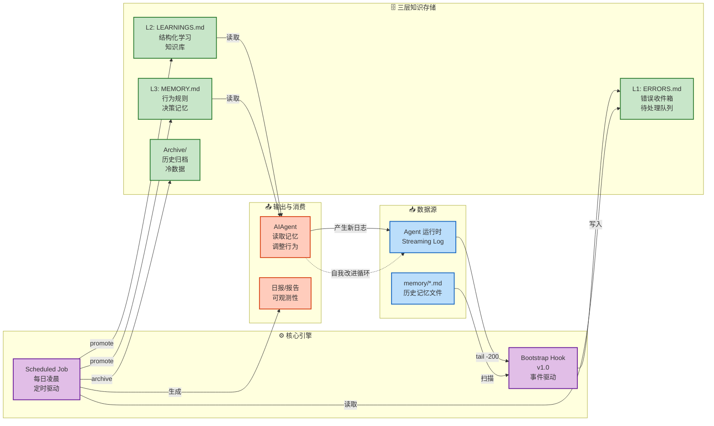

# 书内 · 教材 RAG 课程学习助手

本项目新增面向 Railway 的多账户在线学习工作台。上传不同教材后，每轮提问只检索当前账户、当前书籍中的文本；切书不携带其他教材的会话。原 OpenClaw 错误记录 Hook 保留，但不参与课程助手的知识来源。

## 当前能力

- 账户注册、登录和可选邀请码；密码使用 PBKDF2 哈希，Cookie 会话配合 CSRF 校验。教材、会话、原文件下载和引用均在服务端按账户与书籍过滤。
- 上传 UTF-8 `.md`、`.markdown`、`.txt`；自动识别 Markdown 标题、后台分块索引。扫描教材需先自行 OCR 为 Markdown；不处理图片、图表、公式图片或远程链接。单文件 20 MB、400 万字符，默认每账户 20 本书、50 MB 原文件。
- 教材问答、章节讲解、要点梳理、自测练习；可选择检索章节、保存和切换学习对话。自测的答案与解析默认折叠。
- 引用可展开真实章节与原文分块；Markdown 不编造页码。没有命中依据则明确拒答；模型缺失引用或编造引用编号时不保存回答。
- SQLite FTS5（jieba 分词）与词法匹配为基础，配置云端 BGE / OpenAI 兼容 embedding 后启用向量通道，等权 RRF（k=60）融合。默认最多 6 段、每段 1200 字符、重叠 160 字符。
- 可选联网补充：配置 `STUDY_SEARCH_MCP_URL` / `STUDY_SEARCH_API_KEY`（默认指向智谱 GLM Coding Plan 的联网搜索 MCP，`webSearchPrime` 工具）后，问答题型出现“联网补充”开关。默认关闭；开启后模型在教材证据不足时可调用联网检索，网络来源以 W 编号引用，点击打开原网页，回答必须仍以教材 C 引用为锚点，纯网络内容不能替代教材依据。

与参考 RAG 规则的差异：这里不是“多个启用分类共同检索”，而是强制单书范围；不引入 Skill Catalog RAG。未配置或无法连接 embedding 时，明确降级为关键词检索，不把 hash 投影冒充语义向量。embedding 空间按接口、模型和维度共同标识，不混算不同空间的向量。暂不包含本地 ONNX 自动下载与降级。

## Railway 部署

1. 将本仓库连接到一个独立 Railway 服务，使用仓库内 `Dockerfile` 和 `railway.toml`；不要覆盖其他现有应用服务。健康检查为 `/health`。
2. 给该服务挂载持久 Volume，路径 `/data`，设置 `STUDY_DATA_DIR=/data`。SQLite、教材原文件、索引、账户与会话都保存在这里。没有 Volume 时，重建容器会丢数据。
3. 配置下面的环境变量并生成 HTTPS 域名。密钥只填写在 Railway Variables，不能提交进 Git。`.env.example` 用于查看完整变量列表。
4. 保持 **1 个副本、1 个 Gunicorn worker**。当前 SQLite 和后台索引队列为单实例架构；不要自行增加 worker 或副本。需要水平扩展时，应先迁移外部数据库和任务队列。
5. 注册账户并在网页上传教材。`Asset/`、`.env`、本地数据目录均被 Git / Docker 排除，仓库中的素材不会自动上传或公开。

| 变量 | 用途 |
|---|---|
| `STUDY_SECRET_KEY` | 必填，至少 32 字符的持久随机密钥；更换后全部会话失效 |
| `STUDY_DATA_DIR` | `/data`，必须与 Railway Volume 挂载路径一致 |
| `STUDY_COOKIE_SECURE` | Railway 必须为 `1`；本地 HTTP 才设 `0` |
| `STUDY_LLM_BASE_URL` | OpenAI 兼容服务根地址，推荐以 `/v1` 结尾；调用 `/chat/completions` |
| `STUDY_LLM_API_KEY` / `STUDY_LLM_MODEL` | 问答服务令牌与模型名；无鉴权的本机服务可留空令牌 |
| `STUDY_LLM_JSON_MODE` | 默认 `0`；仅在模型支持 `response_format=json_object` 时改为 `1` |
| `STUDY_EMBED_BASE_URL` / `STUDY_EMBED_API_KEY` / `STUDY_EMBED_MODEL` | 可选向量服务，调用 OpenAI 兼容 `/embeddings`，模型默认 `bge-large-zh` |
| `STUDY_SEARCH_MCP_URL` / `STUDY_SEARCH_API_KEY` | 可选联网搜索 MCP（流式 HTTP），默认智谱 `web_search_prime`；配置后出现“联网补充”开关，不配置则完全书内 |
| `STUDY_REGISTRATION_OPEN` | `1` 开放注册，`0` 关闭新用户注册，已有用户仍可登录 |
| `STUDY_INVITE_CODE` | 建议课堂使用时设置，避免公开注册消耗模型额度 |
| `STUDY_MAX_USERS` / `STUDY_MAX_BOOKS` | 默认 100 个账户、每账户 20 本教材 |

未提供 `STUDY_EMBED_BASE_URL` 时，会整组回退到参考项目的 `BAA_CLOUD_EMBED_URL`、`BAA_CLOUD_EMBED_TOKEN`、`BAA_CLOUD_EMBED_MODEL`；不会将一组端点与另一组密钥混用。不内置任何私人域名或密钥。模型地址要求 HTTPS（本机 localhost 可用 HTTP）。更换向量模型后点击“重新索引”；该操作会清除这本书的旧会话，防止旧引用关联新分块。

可用 `python -c "import secrets; print(secrets.token_hex(32))"` 生成随机密钥，然后自行填入环境变量。请定期备份 Volume；备份包含用户内容与账户凭据哈希，需按私有数据保管。

## 本地启动与人工验收

需要 Python 3.11+，网页为原生 JavaScript/CSS，不需要前端编译。

```sh
python -m venv .venv
# Activate this environment using the command appropriate for your shell.
python -m pip install -r requirements.txt
# Copy .env.example to .env and fill in the model settings.
python -m study
```

浏览器打开 `http://127.0.0.1:8080`。已进入 Python 环境后，也可以 `npm start`。`npm run build` 只用于旧 OpenClaw Hook，不是课程助手部署的必要步骤。

已添加供用户自行运行的回归测试：`python -m unittest discover -s tests -v`（或 `npm run test:study`）。请重点人工验证：两个账户访问同一教材 ID 应被拒绝；同账户两本内容互相矛盾的教材切换后不串回答；选择章节后引用不越界；重索引后的旧引用失效；断网或切书时旧响应不会进入新对话。

本轮实现只做静态复核，未运行构建、测试、应用服务或真实模型调用，也未推送代码或实际部署到 Railway。模型接口目前按 OpenAI 兼容协议适配，需使用实际配置完成联调。

## 边界与注意事项

- 单书检索、会话归属和引用编号由代码强制验证；**引用存在不等于模型结论一定被引文支持**。当前没有独立的逐条蕴含核验模型，仍需核对原文，不能承诺零幻觉。
- 泛化“讲解本章 / 梳理本章 / 本章自测”按位置抽取最多 6 段辅助学习，不是完整章节课程生成器。建议选择小章节并提出具体问题。
- 教材文本保存在服务端，部署管理员可访问 Volume；“账户隔离”不是端到端加密。配置 embedding 时，教材分块发送到向量服务；提问时，命中的原文片段和近期问题发送到问答服务。只上传你有权使用并愿意交给这些服务处理的材料。
- 目前没有邮件验证、密码找回、管理员面板、学习计划、错题本、计费、流式生成或分布式队列。停止等待只取消浏览器请求，后台可能仍会完成；重新打开对话可查看已保存结果。
- 法律等时效性教材仅供课程学习，不自动检索最新法规，也不代替专业意见。OCR 错误必须在原文件中修正后重新上传。
- 联网补充是显式开关且默认关闭：开启后仅模型提炼的检索词会发送到搜索 MCP 服务（非完整对话），网络结果只能作为 W 引用补充，服务端校验会拒绝缺失教材 C 引用或编造编号的回答；网络内容未经核实，不代表教材观点。

---

## 旧版 OpenClaw 自我改进 Hook（保留）

以下为原 Hook 文档，与上面的课程助手分别运行；其中历史计划不代表新增课程助手已经实现的能力。

[](#)
[](#)
[](#)
[](#)
[](./LICENSE)
[](#)
> **中文**：面向 AI Agent 的自动学习系统：启动检测错误、定时提升经验、持续沉淀行为记忆。\
> **English**: A self-improvement system for AI agents: detect errors at bootstrap, promote learnings on schedule, and accumulate durable behavioral memory.
> - 在启动阶段自动检测错误信号
> - 将结构化错误写入 `ERRORS.md`
> - 将可复用经验提升到 `LEARNINGS.md` / `MEMORY.md`
> - 内建幂等、去重、冷却、归档与安全写入机制

---

[English Documentation (README.md)](./README.md)

---

## 为什么需要这个项目

Agent 往往会在不同会话中重复犯同类错误。\
本项目将运行时失败与用户纠正沉淀为可持续复用的操作知识。

**目标：** 让系统形成“错误 → 提取 → 学习 → 记忆”的持续进化闭环。

---

## 工作流总览（自我改进闭环）



---

## 核心特性

- **Bootstrap Hook v1.0（核心）**
  - 扫描最近的 memory 文件
  - 仅扫描最新日志文件的**最后 200 行**
  - 命中后抓取**前后 20 行**上下文
- **稳健写入安全**
  - 文件锁（并发保护）
  - 原子写入（`tmp -> rename`）
- **噪声控制**
  - 单次运行内按规范化 key 去重
  - 跨运行 24h 冷却去重
- **基于优先级的提升策略**
  - `low`：仅标记解决
  - `medium`：写入 `LEARNINGS.md`
  - `high/critical`：写入 `LEARNINGS.md` + `MEMORY.md`
- **幂等契约**
  - 提升时通过 `Source-Err-ID` 防重复写入
- **知识库卫生**
  - `LEARNINGS.md` 超阈值自动归档
  - 每日成功处理后重置 `ERRORS.md`

---

## 架构说明

```text
[Bootstrap Hook v1.0]
  ├─ 扫描 memory/*.md（近期文件）
  ├─ 扫描最新流式日志（最后 200 行）
  ├─ 模式识别 + 上下文窗口抓取（±20）
  ├─ 规范化去重 + 24h 冷却
  ├─ 文件锁 + 原子写入 -> .learnings/ERRORS.md
  └─ 注入 SELF_IMPROVEMENT_REMINDER.md（虚拟启动文件）

[Scheduled Auto-Learning Job]
  ├─ 解析待处理 ERR 块
  ├─ 按优先级路由（low/medium/high/critical）
  ├─ 幂等写入 LEARNINGS / MEMORY
  ├─ 标记 resolved + Processed-At + Disposition
  ├─ 超阈值时归档 LEARNINGS
  └─ 重置 ERRORS.md 模板
```

---

## 仓库结构

```text
self-learning-genius-agent/
├── README.md
├── README.zh-CN.md
├── QUICKSTART.md
├── CONTRIBUTING.md
├── CHANGELOG.md
├── LICENSE
├── package.json
├── tsconfig.json
├── .eslintrc.json
├── .prettierrc.json
├── .learnings/
│   ├── ERRORS.md
│   ├── LEARNINGS.md
│   └── archive/
└── self-improvement/
    ├── handler.ts
    └── HOOK.md
```

---

## Bootstrap Hook v1.0（核心要点）

将 self-improvement 放在 .openclaw\Hook：

该 Hook 面向 `agent/bootstrap` 事件，执行以下操作：

1. 扫描最近 memory 文件（`MAX_MEMORY_FILES=3`）
2. 扫描最新 `.log` 文件（尾部窗口 `MAX_LOG_LINES=200`）
3. 识别错误模式（工具错误、解析错误、用户纠正等）
4. 捕获命中上下文（`CONTEXT_RADIUS=20`）
5. 规范化摘要，生成稳定去重键
6. 对相同错误键应用 24h 冷却
7. 使用锁 + 原子写入追加到 `ERRORS.md`
8. 注入提醒 markdown 到启动上下文

---

## Header 一致性（重要）

`ERRORS.md` 统一使用以下标准头部：

```md
# ERRORS
<!-- Auto-generated error inbox. New pending errors will be appended below. -->
<!-- Fields recommended: ERR-ID, Priority, Status, Area, Summary, Details, Logged -->
```

如果当前 Hook 仍在检查 `# ERRORS.md...`，建议兼容旧格式读取，但后续统一写入 `# ERRORS`。

---

## `ERRORS.md` 条目格式

```md
## [ERR-YYYYMMDD-HHMMSS-XXX] category

**Logged**: YYYY-MM-DDTHH:MM:SS.sssZ
**Priority**: low|medium|high|critical
**Status**: pending
**Area**: config|exec|system|chart-generate|github|llm|backtest

### Summary
一句话摘要

### Details
错误信息、上下文、失败原因

### Metadata
- Source: correction|error|knowledge_gap|detected_at_bootstrap
- Tags: [relevant-tags]
---
```

---

## 自动学习提升规则

### 优先级路由

- **low**
  - 不写入 LEARNINGS/MEMORY
  - 标记为 `resolved`
  - `Disposition: skipped_low`
- **medium**
  - 写入 `LEARNINGS.md`（幂等）
  - 标记为 `resolved`
  - `Disposition: learned_medium`
- **high/critical**
  - 写入 `LEARNINGS.md`（幂等）
  - 写入简明规则至 `MEMORY.md`（幂等）
  - 标记为 `resolved`
  - `Disposition: promoted_high`

### 幂等契约（强制）

写入 `LEARNINGS.md` 或 `MEMORY.md` 前，必须检查：

```text
Source-Err-ID: ERR-...
```

若已存在，则跳过写入。

---

## 归档策略

当满足任一条件时归档 `LEARNINGS.md`：

- 条目数 > `120`，或
- 文件大小 > `256KB`

归档动作：

1. 将最旧条目移动到 `archive/LEARNINGS-YYYYMM.md`
2. `LEARNINGS.md` 保留最新 `80` 条

---

## 每日重置

仅在**完整成功**处理后（提升 + 状态更新 + 归档）重置 `ERRORS.md` 为模板头。

> 若任务中途失败，禁止重置。

---

## 调度方式

### Linux/macOS（cron）

```cron
30 3 * * * /usr/bin/node /path/to/auto-learning.js >> /path/to/auto-learning.log 2>&1
```

### Windows 任务计划程序

- 触发器：每天 03:30
- 操作：`node.exe C:\path\to\auto-learning.js`
- 起始目录：项目根目录
- 建议开启失败重试

---

## 示例报告

```text
📚 Auto-Learning Report | 2026-04-23

Pending in ERRORS.md: 12
- skipped low: 3
- written to LEARNINGS.md: 7
- promoted to MEMORY.md: 2
- idempotency skipped: 1

LEARNINGS: 86 entries (198 KB)
ERRORS.md reset: done
```

---

## 配置（默认值）

- `MAX_MEMORY_FILES = 3`
- `MAX_LOG_LINES = 200`
- `CONTEXT_RADIUS = 20`
- `MAX_NEW_ENTRIES_PER_RUN = 20`
- `DEDUP_COOLDOWN_MS = 24h`
- `LOCK_STALE_MS = 30s`
- `LOCK_WAIT_MS = 8s`

---

## 安全与可靠性说明

- 文件锁避免并发追加导致的内容损坏
- 原子写入避免写入中断导致的文件截断
- 冷却去重降低重复噪声
- 上下文窗口提升后续根因提取质量

---

## 安装

### 前置要求
- Node.js >= 18.0.0
- OpenClaw >= 1.0.0
- TypeScript 5.0+

### 快速安装

```bash
git clone https://github.com/yourusername/self-learning-genius-agent.git
cd self-learning-genius-agent
npm install
npm run build
openclaw hooks enable self-improvement
```

详细安装说明请参考 [QUICKSTART.md](./QUICKSTART.md)。

---

## 快速开始

1. **启用 Hook（一次性）**
   ```bash
   openclaw hooks enable self-improvement
   ```
2. **启动 Agent**
   ```bash
   openclaw session
   ```
3. **查看学习产物**
   ```bash
   cat .learnings/ERRORS.md
   cat .learnings/LEARNINGS.md
   ```

---

## 环境变量

```bash
OPENCLAW_WORKSPACE=/path/to/workspace
OPENCLAW_LOGS_DIR=/path/to/logs
```

---

## 路线图（Roadmap）

- [ ] SQLite 幂等索引
- [ ] 语义去重（基于 embedding）
- [ ] 审核/批准仪表盘
- [ ] 通知集成（Slack/飞书/Email）
- [ ] 多 Agent 共享记忆总线

---

## 贡献指南

欢迎贡献！请按以下流程：

1. Fork 仓库
2. 新建功能分支（`git checkout -b feature/your-feature`）
3. 提交更改（`git commit -am 'Add feature'`）
4. 推送分支（`git push origin feature/your-feature`）
5. 创建 Pull Request

---

## 许可证

GPL-3.0 —— 详见 [LICENSE](./LICENSE)。

---

## 支持

- **文档**: [QUICKSTART.md](./QUICKSTART.md) | [README.md](./README.md)
- **OpenClaw**: https://docs.openclaw.ai/automation/hooks#hooks
