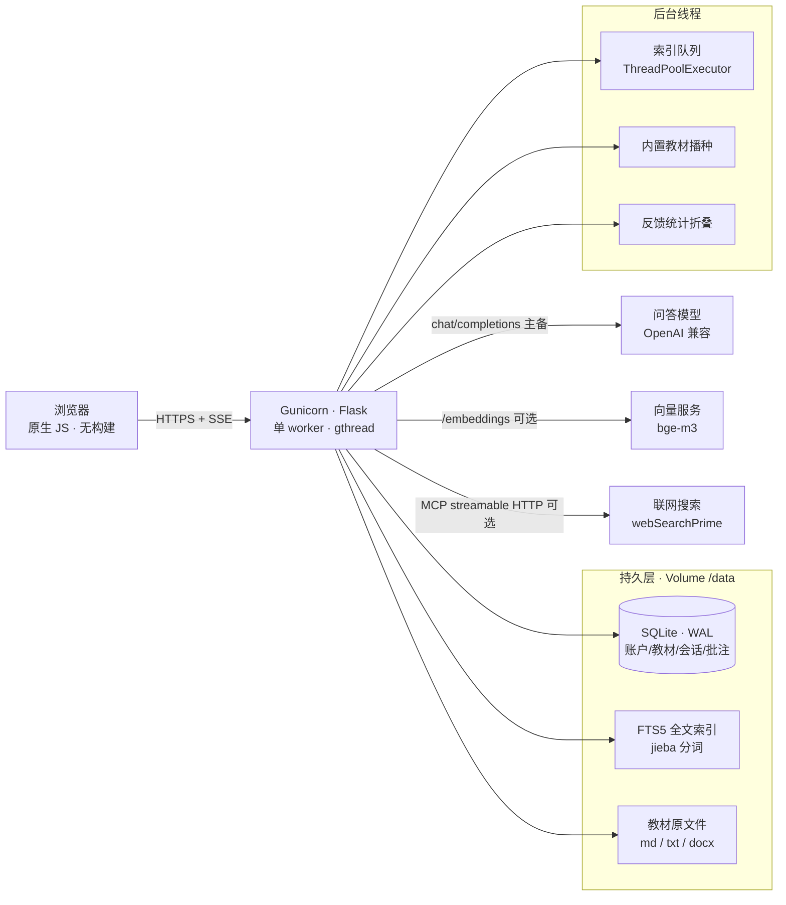
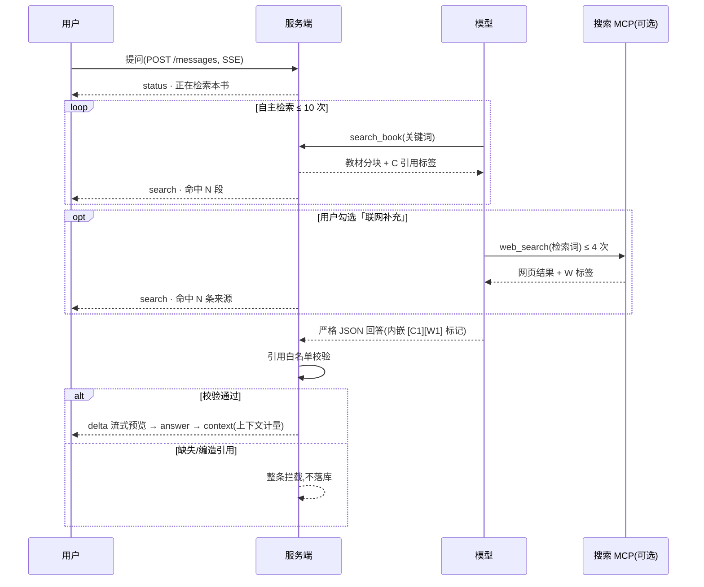
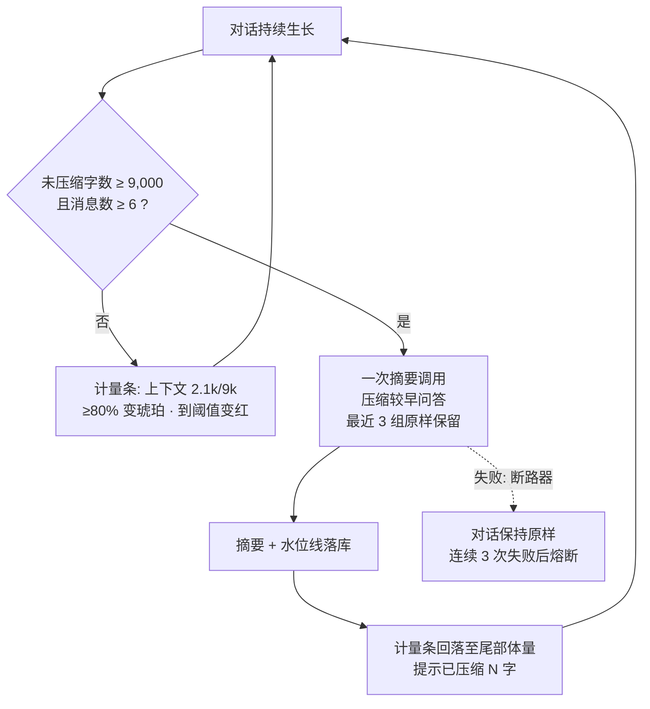
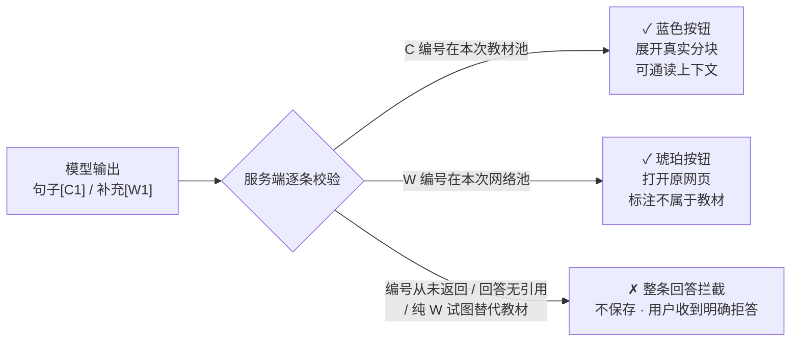

# 书内 · Book Learning

[English](README.md) · **中文**


**把教材放进书架,让每一次回答都带你回到原文。**

「书内」是一个可自部署的多账户教材学习工作台:上传 Markdown / TXT / DOCX 教材,在问答、讲解、梳理、自测四种模式间切换,每个结论都附带可展开核对的原文引用;内置批注阅读器、长对话自动压缩与可选的联网补充检索。数据归属账户与教材,单书限定检索,书与书互不串答。

---

## 图说

### 图 1 · 系统架构

整体是单实例 Flask 服务(Gunicorn 单 worker),SQLite 承载全部状态,外部依赖只有模型/向量/搜索三类服务,全部可选、全部可降级:



**说明**:浏览器只与本服务通信(严格 CSP,无第三方请求)。检索三通道——词法、FTS5、向量——等权 RRF(k=60)融合;未配置向量服务时明确降级为关键词检索并在界面标注。联网搜索是独立开关,不开启时系统完全书内运行。

### 图 2 · 一次问答的数据流

教材问答(qa 模式)由模型自主驱动检索,经典单轮检索作为兜底:



**说明**:引用标签由服务端在检索时分配,模型只能使用返回过的编号——缺失引用、编造编号、纯网络内容替代教材依据的回答都会被整条拒绝保存。前端实时展示每一次检索步骤,回答下方保留完整检索轨迹。

### 图 3 · 长对话压缩与上下文计量

输入框右侧的计量条实时显示未压缩上下文与压缩阈值的比例,压缩由服务端自动完成:



**说明**:摘要作为不可信上下文随下一轮提示下发(系统提示禁止把它当指令),引用标记不进入摘要;每轮回答后 SSE `context` 事件刷新计量条,切回会话时从历史接口恢复读数。

### 图 4 · 引用信任链

C 引用(教材)与 W 引用(联网)双轨校验,这是「没有依据就不补写答案」的执行机制:



**说明**:教材引用展开的是原文分块及相邻段落(阅读器内可继续通读、加批注);网络引用仅作补充,回答整体必须至少锚定一个 C 引用。

---

## 功能特性

- **多账户工作台**:注册 / 登录 / 测试码一码一户 / 自带 API Key(BYO);密码 PBKDF2,会话 Cookie + CSRF。教材、会话、批注、原文件全部按账户 + 教材双重隔离。
- **教材上传与索引**:UTF-8 `.md` / `.markdown` / `.txt` / `.docx`,自动识别章节标题,后台分块索引(默认每段 ≤ 1200 字符、重叠 160);单文件 20 MB / 400 万字符,每账户 20 本 / 50 MB。
- **四种学习模式**:教材问答(模型自主多轮检索)、章节讲解、要点梳理、自测练习(答案默认折叠);可按章节缩小检索范围。
- **证据约束生成**:如「图 4」,回答必须落在本轮检索到的证据上,没有依据则明确拒答。
- **批注阅读器**:全文通读、引用定位上下文、划线高亮三色批注(按账户私有,不发送给模型)。
- **长对话压缩 + 上下文计量**:如「图 3」。
- **可选联网补充**:配置搜索 MCP(默认智谱 `webSearchPrime`)后出现开关,默认关闭;如「图 2」,仅模型提炼的检索词出网。
- **运行日志与反馈统计**:问答 / 索引 / 联网调用逐条留痕(保留 3 天),满意 / 不满意评价沉淀为周期统计。

## 快速开始(本地)

需要 Python 3.11+,前端为原生 JS / CSS,无构建步骤:

```sh
python -m venv .venv
# 按所用 shell 激活虚拟环境
python -m pip install -r requirements.txt
copy .env.example .env   # 填入模型配置
python -m study
```

浏览器打开 `http://127.0.0.1:8080`。回归测试:`python -m unittest discover -s tests -v`(纯离线,不调用真实模型)。

## 环境变量

| 变量 | 说明 |
|---|---|
| `STUDY_SECRET_KEY` | **必填**,≥ 32 字符持久随机密钥;更换后全部会话失效 |
| `STUDY_DATA_DIR` | 数据目录;Railway 用 Volume 挂载 `/data`,本地默认 `.study-data/` |
| `STUDY_COOKIE_SECURE` | HTTPS 部署必须 `1`,本地 HTTP 设 `0` |
| `STUDY_LLM_BASE_URL` / `STUDY_LLM_API_KEY` / `STUDY_LLM_MODEL` | 问答模型,OpenAI 兼容 `/chat/completions` |
| `STUDY_LLM_MAX_TOKENS` | 输出预算(1000–200000),推理模型需调大 |
| `STUDY_LLM_JSON_MODE` | 模型支持 `response_format=json_object` 时设 `1` |
| `STUDY_LLM_FALLBACK_*` | 可选备用模型;仅首个可见增量前切换 |
| `STUDY_EMBED_BASE_URL` / `STUDY_EMBED_API_KEY` / `STUDY_EMBED_MODEL` | 可选向量服务(OpenAI 兼容 `/embeddings`);更换模型后需重新索引 |
| `STUDY_SEARCH_MCP_URL` / `STUDY_SEARCH_API_KEY` | 可选联网搜索 MCP(流式 HTTP),默认智谱 `web_search_prime`;不配置则无联网能力 |
| `STUDY_REGISTRATION_OPEN` / `STUDY_TEST_CODES` / `STUDY_INVITE_CODE` | 注册策略:开放注册 / 一码一户测试码 / 邀请码 |
| `STUDY_MAX_USERS` / `STUDY_MAX_BOOKS` | 默认 100 账户 / 每账户 20 本教材 |

密钥只写环境变量(Railway Variables / 本地 `.env`),永不入库;`.env`、教材原文件、本地数据目录均被 Git 与 Docker 上下文排除。

## Railway 部署

1. 仓库连接到独立 Railway 服务,使用仓库内 `Dockerfile`(健康检查 `/health`)。
2. 挂载持久 Volume 到 `/data`,设置 `STUDY_DATA_DIR=/data`、`STUDY_COOKIE_SECURE=1`。
3. 保持 **1 副本、1 Gunicorn worker**(SQLite + 单实例索引队列架构;水平扩展前需先外置数据库与任务队列)。
4. `railway up` 亦可从本地直传构建;`builtin_books/` 内置教材仅在本地磁盘存在,不进 Git,会随构建打包进镜像。

## 隐私与边界

- 教材与服务端数据按账户隔离,但**不是端到端加密**;部署管理员可访问 Volume。
- 配置向量服务时,教材分块在索引时发送到该服务;提问时,命中的原文片段与近期问题发送到问答服务;勾选联网时,仅检索词(非完整对话)发送到搜索 MCP。
- 网络引用内容未经核实,不代表教材观点;法律类教材可能过时,回答不构成现行法律或个人法律意见。
- 无邮件验证、密码找回、管理员面板、计费与流式中断回滚;停止等待只取消浏览器请求,后台可能仍完成。

## 项目结构

```text
study/            # Flask 后端
  app.py          #   路由、SSE 问答流、账户与配额
  tutor.py        #   证据约束生成、agent 检索循环、C/W 引用校验
  rag.py          #   词法 / FTS5 / 向量三通道 RRF 检索
  reader.py       #   全文阅读器与批注 API
  websearch.py    #   搜索 MCP 客户端(流式 HTTP)
  compaction.py   #   长对话滚动压缩与上下文计量
  documents.py    #   md / txt / docx 解析与分块
  database.py     #   SQLite schema 与迁移
web/              # 原生 JS / CSS 前端(无构建)
tests/            # 114 项离线回归测试
docs/             # 分专题文档(架构 / 配置 / 开发 / 维护)
builtin_books/    # 内置教材(本地保留,不入 Git)
```

## 历史:OpenClaw 自我改进 Hook

仓库早期为一个面向 AI Agent 的自我改进系统(启动检测错误、定时提升经验、沉淀行为记忆),见 [QUICKSTART.md](QUICKSTART.md) 与 `self-improvement/`;它与课程助手分别运行,历史计划不代表现有能力。

## 许可证

[GPL-3.0](LICENSE)
